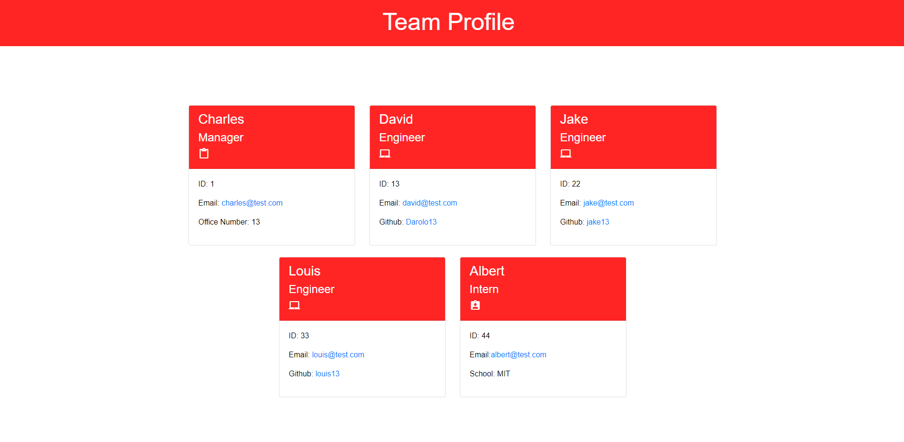

# _Team-Profile-Generator_
A simple app that takes in information about employees on a software engineering team through a Node.js command-line using inquirer and generates an HTML webpage that displays summaries for each person.

## Table of Contents
* [Technologies Used](#technologies-used)
* [Features](#features)
* [Screenshot](#screenshot)
* [Project Status](#project-status)
* [Room for Improvement](#room-for-improvement)

## Technologies Used
- Tech 1 - JavaScript
- Tech 2 - Node.js
- Tech 3 - CSS
- Tech 4 - HTML

## Features
Ready Features:
1. **Show team members**
- Allows to create team members and display their information.

2. **Allows to view the team manager and his/hers info**
3. **Allows to view the team engineer's and their info**
4. **Allows to view the team intern's and their info**

## Installation
To use this project, please install:

`npm install inquirer`

## Screenshot
### Team Profile Generator:

## Tests
You can run tests using:

`npm run test`

## Project Status
Project is: _in progress_

## Room for Improvement
Room for improvement:
- TBD

To do:
- Improve design
- Add local Storage
